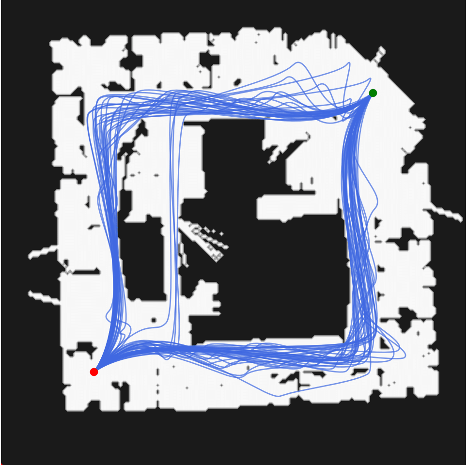

# Global Tensor Motion Planning

This repository implements Global Tensor Motion Planning `gtmp` and its smooth structure GTMP-Akima in JAX. 


<p float="middle">
   
</p>


## Paper Preprint

This work has been submitted to IEEE RA-L. Please find the pre-print here:

[](https://arxiv.org/abs/2411.19393)

## Installation

Activate your conda/Python environment, clone and install `kinax`:

```azure
git clone git@github.com:anindex/kinax.git
cd kinax
pip install -e .
```

Then, navigate to `gtmp` root directory and install

```azure
pip install -e .
```

Please install [JAX with CUDA support](https://github.com/google/jax#installation) if you want to run the code on GPU.

## Examples

Please find in `examples/` folder the demo of vectorized planning in planar environments with occupancy map:

```azure
python examples/gtmp_occupancy.py
```

We also added a demo with vectorized Panda planning with [MBM Dataset](https://github.com/KavrakiLab/motion_bench_maker):

```azure
python examples/gtmp_mbm.py
```

Please see the `configs/` folder to select task and problem index.

**Tuning Tips**:

- `M`: the number of GTMP layer. In principle, we start tuning from `M = 1` since most problems are suprisingly can be solved with one layer. The minimum layer such that the problem can be solved is usually the optimal number of layer.
- `N`: the number of points per layer, which depends on the GPU memory. The more `N` the better in term of solvability, the worse computation time.
- `H`: the number of probing, which depends on the GPU memory. We set this moderately high depending on problem to ensure collision avoidance. 

## Acknowledgement

The occupancy maps are retrieved from this [link](http://www2.informatik.uni-freiburg.de/~stachnis/datasets.html).

The Motion Bench Marker dataset for Franka Emika Panda is retrieved from [vamp repository](https://github.com/KavrakiLab/vamp/tree/main/resources)

## Citation

If you found this repository useful, please consider citing these references:

```azure
@misc{le2024globaltensormotionplanning,
      title={Global Tensor Motion Planning}, 
      author={An T. Le and Kay Hansel and João Carvalho and Joe Watson and Julen Urain and Armin Biess and Georgia Chalvatzaki and Jan Peters},
      year={2024},
      eprint={2411.19393},
      archivePrefix={arXiv},
      primaryClass={cs.RO},
      url={https://arxiv.org/abs/2411.19393}, 
}
```
