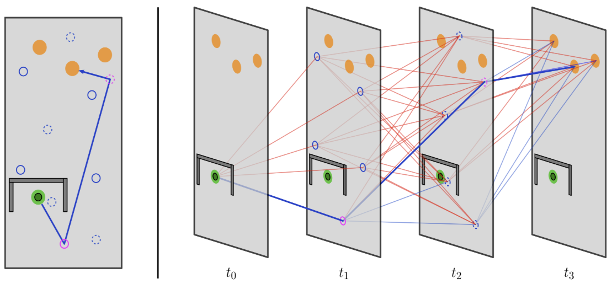

# GTMP - Global Tensor Motion Planning

[](LICENSE)
[](https://www.python.org/downloads/)
[](https://github.com/google/jax)
[](https://arxiv.org/abs/2411.19393)

**GTMP** is a massively parallelized motion planner built on [JAX](https://github.com/google/jax). It plans diverse, collision-free trajectories by solving an MDP over randomly sampled *dream points*, using value iteration to find globally optimal paths through multi-layer waypoint graphs - all fully vectorized and JIT-compiled for GPU acceleration.

> This work has been published at IEEE RA-L 2025: [Global Tensor Motion Planning](https://ieeexplore.ieee.org/document/11018416).

<p align="center">
  
</p>

## Key Features

- **Massive Parallelism** - Plan hundreds of diverse paths simultaneously via `jax.vmap`
- **Smooth Trajectories** - Optional Akima spline interpolation produces C¹-continuous paths with velocity profiles
- **Path Diversity** - Quantified via optimal transport (Sinkhorn distance) using [OTT-JAX](https://github.com/ott-jax/ott)
- **Memory Efficient** - Configurable dtype (`float32`/`bfloat16`), stratified sampling, and fused probe evaluation

## Architecture

```
gtmp/
├── planners.py          # Core GTMP & GTMP-Akima algorithms
├── splines.py           # Akima spline interpolation (LayerPPoly)
├── metrics.py           # Path diversity, cosine similarity (OTT-JAX)
├── objectives/
│   ├── occupancy_map.py # 2D/3D grid-based collision
│   ├── primitives.py    # SDF primitives (sphere, cylinder, cuboid)
│   ├── sphere_approximation.py  # Sphere-based robot collision
│   ├── costs.py         # Composite cost functions with FK
│   └── embodiment.py    # Self-collision & EE distance fields
├── kinematics/
│   ├── robot.py         # URDF FK via kinax (jaxlie SE(3))
│   └── point_mass.py    # Simple point mass robot
├── pybullet.py          # PyBullet visualization & animation
└── files.py             # Path utilities
```

## Installation

**Prerequisites:** Python >= 3.11, CUDA-capable GPU recommended.

```bash
# 1. Install JAX with GPU support (see https://jax.readthedocs.io/en/latest/installation.html)
pip install "jax[cuda12]"

# 2. Install kinax (FK engine)
git clone https://github.com/anindex/kinax.git
pip install -e kinax/

# 3. Install GTMP
git clone https://github.com/anindex/gtmp.git
pip install -e gtmp/
```

## Quick Start

### 2D Occupancy Grid Planning

```python
import jax
from jax import jit, vmap
import jax.numpy as jnp

from gtmp import GTMPState, gtmp_plan, OccupancyMap

# Create environment
occ = jnp.zeros((100, 100)).at[30:70, 40:60].set(1)  # rectangular obstacle
limits = jnp.array([[0.0, 10.0], [0.0, 10.0]])
occ_map = OccupancyMap.from_prob(occ, limits=limits, threshold=0.5, infinite_cost=True)

# Configure planner
state = GTMPState.create(
    q=jnp.array([1.0, 1.0]),           # start
    goals=jnp.array([[9.0, 9.0]]),      # goals
    bounds=limits,
    occ_map=occ_map,
    num_dreams=100,                      # N: dream points per layer
    num_layers=2,                        # M: intermediate layers
    num_probes=50,                       # H: collision checks per edge
)

# Plan 100 diverse paths in parallel
keys = jax.random.split(jax.random.PRNGKey(0), 100)
planner = jit(vmap(gtmp_plan, in_axes=(0, None)))
results = planner(keys, state)

# Results
print(f"Collision-free: {1 - results.collision.mean():.0%}")
free_paths = results.path[~results.collision]  # shape: (K, M+2, 2)
```

### 7-DoF Manipulator Planning (MBM Benchmark)

```bash
python examples/gtmp_mbm.py
```

### GTMP-Akima (Smooth Splines)

```bash
python examples/gtmp_occupancy.py planner.name=akima
```

## Examples

| Example | Description | Config |
|---------|-------------|--------|
| `examples/gtmp_occupancy.py` | 2D occupancy map planning | `configs/demo_gtmp_occupancy.yaml` |
| `examples/gtmp_mbm.py` | 7-DoF Panda robot on MBM benchmark | `configs/demo_gtmp_mbm.yaml` |
| `examples/plot_akima_splines.py` | Visualize Akima spline layer structure | - |

## Configuration Guide

### Key Parameters

| Parameter | Symbol | Effect | Typical Range |
|-----------|--------|--------|---------------|
| `num_dreams` | N | Dream points per layer. More = better coverage, higher memory | 50-500 |
| `num_layers` | M | Intermediate waypoint layers. More = longer paths, finer control | 1-5 |
| `num_probes` | H | Collision probes per edge. More = safer paths, slower | 10-50 |
| `gamma` | γ | Discount factor (infinite-horizon VI). Higher = more forward-looking | 0.9-0.99 (unused when `vi_finite=True`) |
| `vi_finite` | - | Use finite-horizon VI (recommended for most cases) | `True` |
| `use_stratified` | - | Stratified dream point sampling for better coverage | `False` |
| `dtype` | - | `jnp.float32` (default) or `jnp.bfloat16` for memory savings | - |

### Memory Scaling

| Component | Memory | Note |
|-----------|--------|------|
| Dream points | O(M × N × D) | Manageable |
| Probe points | O(N × H × D) per layer | Moderate |
| Cost matrices | O(M × N²) | **Dominant for straight** |
| Akima coefficients | O(4 × M × D × N²) | **Dominant for Akima** |

**Tips:**
- For memory-constrained GPUs, reduce N first, then H
- Use `dtype=jnp.bfloat16` for ~2× memory reduction with minimal accuracy loss
- Enable `use_stratified=True` to get equivalent coverage with fewer dream points

## Performance

GTMP plans hundreds of diverse, collision-checked paths in a single forward pass. Full benchmark methodology and results are in **[BENCHMARK.md](BENCHMARK.md)**.

### Headline Numbers (RTX 5090, production config N=100, M=2, H=100)

| Batch (K) | Total | Per-plan | GPU vs CPU |
|-----------|-------|----------|------------|
| 100 | 2.8 ms | 28 µs | 29× |
| 500 | 3.5 ms | 7 µs | 116× |
| 1,000 | 4.6 ms | **4.6 µs** | ~177× |

> **1,000 paths in 4.6 ms** - each with 89% collision-free rate, full value-iteration optimality, and collision checking along 100 probe points per edge.

On CPU, the same production config plans 100 paths in ~80 ms (~800 µs/plan).

### Benchmark Script

```bash
python examples/benchmark_timing.py
```

## Dependencies

| Package | Purpose |
|---------|---------|
| [JAX](https://github.com/google/jax) >= 0.5.0 | Core computation engine |
| [Equinox](https://github.com/patrick-kidger/equinox) >= 0.11.0 | PyTree dataclasses |
| [kinax](https://github.com/anindex/kinax) | URDF forward kinematics |
| [jaxlie](https://github.com/brentyi/jaxlie) >= 1.3.0 | SE(3) Lie group operations |
| [OTT-JAX](https://github.com/ott-jax/ott) >= 0.4.0 | Optimal transport (path diversity) |
| [PyBullet](https://pybullet.org/) | 3D visualization |

## Citation

If you found this work useful, please consider citing:

```bibtex
@article{le2025global,
  title={Global tensor motion planning},
  author={Le, An T and Hansel, Kay and Carvalho, Jo{\~a}o and Watson, Joe and Urain, Julen and Biess, Armin and Chalvatzaki, Georgia and Peters, Jan},
  journal={IEEE Robotics and Automation Letters},
  year={2025},
  publisher={IEEE}
}
```

## License

MIT License. See [LICENSE](LICENSE) for details.
